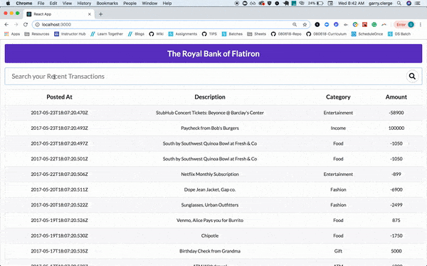

# React Immersive Code Challenge

## Instructions

For this project, you’ll be building out a React application that displays a list of your recent bank transactions.

Part of what this code challenge is testing is your ability to follow given instructions. While you will definitely have a significant amount of freedom in how you implement the features, be sure to carefully read the directions for setting up the application.

When you clone down this project, the component `<AccountContainer />` will be importing transactions from `src/transactionsData`.  Use this data to get the functionality of the app working.  Once that is complete, you can replace that initial state with data you fetch from [this provided API endpoint](https://boiling-brook-94902.herokuapp.com/transactions).

 ## Deliverables

**Please implement the following user stories:**
- As a user, you should be able to see a table of transactions.
- As a user, you should be able to enter text into an input field and dynamically filter the list of transactions by either description or category as you type.
- As a user, you should be able to click on the Title of a column and sort by either posted at, description, category or amount

Use the above gif as an example of how the app should function.

We’ve provided some starter code you can use to guide you, but feel free to create or remove components as you see fit.

## Setup
After cloning down the project
- run `npm install`
- You can boot up the server with `npm start`. It will run on `localhost:3000`.
- On a separate tab run the command `json-server --watch db.json -p 4000` to boot up your backend server.
- The app uses [Semantic UI](https://semantic-ui.com/) for styling. If you see any unfamiliar classNames on some components, don't sweat! That's coming from Semantic UI and you shouldn't need to touch it.

## Suggested Workflow

You can approach this any way you would like but below is a reasonable approach to this challenge. If you are not sure where or how to begin, follow the steps here.

If you are unfamiliar with HTML tables, take a look at the [docs with an example here](https://www.w3schools.com/html/html_tables.asp)

1) Get the list of Transactions to display on the page given the transactions data being imported.
2) Ensure that the user typing into the input field can appropriately update the state.
3) Using the state of the user input and the list of transactions, figure out how to render only the transactions that include the entered text in either the *description* or *category*.
4) Using the state work through sorting each column with a filter remaining as priority.

## Criteria

We’ll be evaluating your code based on the following criteria:
- **React Components:** Does the app reasonably separate responsibilities into components and a have a component hierarchy?
- **Props:** Does the app have at least one presentational component that receives props? Does the app pass props down from a higher-level component to a lower one? Does the app make use of passing a functional prop?
- **State:** Does the app have a search input that responds to changes and calls this.setState?
- **Lifecycle Methods & API:** Does the app make an AJAX request to the API and return data? Does it set the state of the component within the app with that data within a lifecycle method?
- **Feature:** Does the app filter the list of transactions?
- Does the app follow best practices regarding state and component composition?

Good luck!

## Bonus

Now that you've completed all of the above deliverables, get your sort to work in both ascending and descending order!

<!---[Backend Rails API](https://github.com/learn-co-curriculum/immersive-assessment-react-backend)-->
